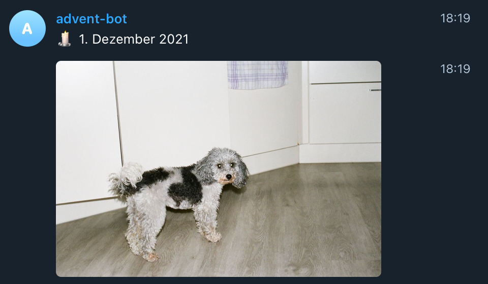

# telegram-advent-calendar

A simple to use Telegram Advent Calendar



Upload 24 photos to the bot, and then have the bot send one photo every day in the morning as the advent calendar.

## Installation

```
bundle install
```

## Bot usage

**Step 0:** Click on [t.me/MyAdventCalendarBot](https://t.me/MyAdventCalendarBot)

**Step 1:** Create a new advent calendar, that will be owned by you by sending the following message to the bot

```
/group [name]
```

whereas `[name]` is for example `felix-krause` (the name of the advent calendar)

**Step 2:** Upload 24 photos to the bot directly via 1:1 chat

The bot will automatically use the group you have just created. Make sure to upload the photos in the correct order, and use the Telegram "Quick Way" to upload the photos.

If the bot tells you to choose a group, just run `/group [name]` again to select the advent calendar to uplaod images to.

**Step 3:** Create a new Telegram group with just you and the bot in it

**Step 4:** Run `/connect [name]` and get the confirmation from the bot that it is connected

**Step 5:** Add the person that should receive the photos to the group

**Step 6:** On the 1st of December, the first photo will be posted at 6:30 AM Central Europe time.

## Server usage

### Locally

```
bundle exec ruby advent.rb
```

### Production

All info to run this in production is already in `./Procfile`. 

Additionally, you have to setup a scheduler, than runs `bundle exec ruby scheduler.rb` every day in the morning.
